# 基于springboot的智能学习平台系统

---
### 👉作者QQ ：1556708905 微信：zheng0123Long (支持定制修改、部署调试、定制毕设)

### 👉接网站建设、小程序、H5、APP、各种系统等

---

#### 介绍

在数字化教育迅速发展的背景下，为了提供更高效、便捷和个性化的学习体验，我们开发了基于 Spring Boot 的智能学习平台系统。该系统旨在整合教学资源，优化教学管理，促进师生互动，提升学习效果。

#### 技术栈

后端技术栈：Springboot+Mysql+Maven

前端技术栈：Vue+Html+Css+Javascript+ElementUI

开发工具：Idea+Vscode+Navicate

#### 系统功能介绍

（一）管理端  
个人中心：管理端人员可在个人中心查看和修改个人信息，查看操作记录和系统通知。  
管理员管理：对不同级别的管理员进行添加、删除、修改操作，明确各级管理员的权限和职责范围。  
基础数据管理：维护系统运行所需的基础数据，如学科分类、教材版本、年级设置等。  
论坛管理：监督论坛的交流内容，处理违规言论，保障论坛的健康交流氛围。  
教师管理：对教师的个人信息、授课资格、教学评价等进行管理。  
课程信息管理：全面统筹课程的规划、安排、更新，包括课程名称、简介、目标、大纲、适用对象等。  
公告信息管理：发布重要的通知、政策、活动等信息，确保师生及时获取关键资讯。  
学生管理：管理学生的个人资料、学籍信息、学习进度、成绩等。  
试卷管理：组织和管理各类考试的试卷，包括试卷的生成、编辑、审核、存储等。  
试题管理：负责试题的录入、分类、难度级别设定、知识点关联等。  
考试管理：安排考试时间、考场、监考人员，处理考试成绩的统计和分析。  
轮播图信息：设置首页的轮播图内容，展示重要通知、热门课程、优秀学生成果等。  

（二）教师端  
试卷表：查看和使用管理端分配或自己创建的试卷。  
论坛：参与论坛交流，解答学生问题，与同行分享教学经验。  
课程信息：创建、编辑和发布自己负责的课程信息，包括课程资料的上传和更新。  
公告信息：接收和查看管理端发布的公告信息，并根据需要传达给学生。  
个人中心：查看和修改个人信息，了解自己的教学任务和评价。  
后台管理
论坛管理：参与论坛的部分管理工作，如置顶重要话题、删除不当言论。  
课程信息管理：对自己的课程进行更细致的管理和调整。  
公告信息管理：协助管理端发布与教学相关的公告信息。  
试卷管理：根据教学需求创建和编辑试卷。  
试题管理：录入和管理与课程相关的试题。  
考试管理：安排和监督自己课程的考试。  
轮播图信息：提供与教学成果相关的素材，参与轮播图内容的策划。  

（三）学生端  
试卷表：查看和参与各类考试的试卷。  
论坛：在论坛中向老师和同学提问，交流学习心得。  
课程信息：选择和学习感兴趣的课程，查看课程详情和学习资料。  
公告信息：及时了解学校和老师发布的通知和公告。  
个人中心：查看个人学习记录、成绩、课程收藏等信息，修改个人资料。  
后台管理  
考试管理：查看考试安排，提交考试答案。  
课程信息管理：对已选课程进行评价和反馈。  
公告信息管理：标记已读公告，方便后续查阅。  

#### 系统作用

优化教学资源管理  
集中管理课程、试卷、试题等教学资源，方便更新和共享，提高资源利用效率。  
促进教学互动  
提供论坛等交流平台，促进师生之间、学生之间的互动，增强学习氛围。  
个性化学习支持  
学生可以根据自己的需求选择课程和学习资源，实现个性化学习。  
提升教学质量  
教师能够更有效地管理教学过程，根据学生反馈调整教学策略。  
提高管理效率  
为管理人员提供便捷的工具，实现对教学活动的全面、高效管理。  
数据驱动决策  
系统收集的学习数据可以为教学决策提供依据，优化教学安排和资源配置。  

#### 系统功能截图

代码结构

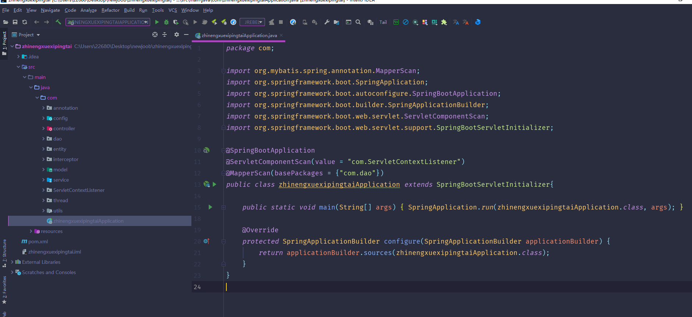

数据库表

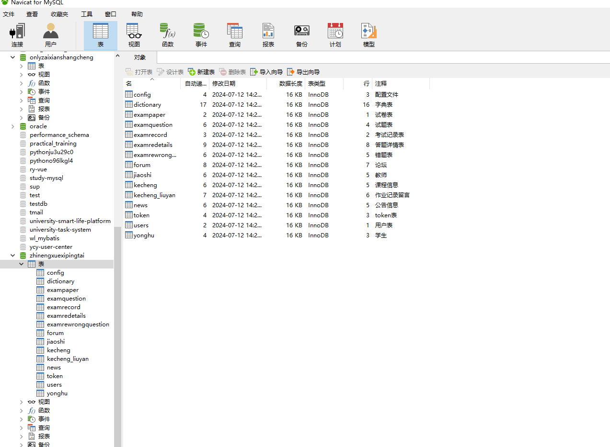

登录

前台页面首页

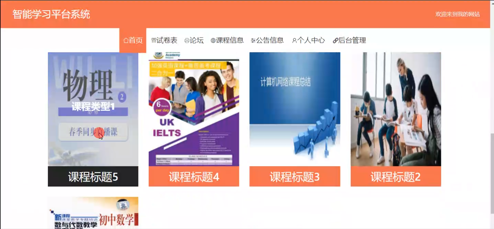

试卷表

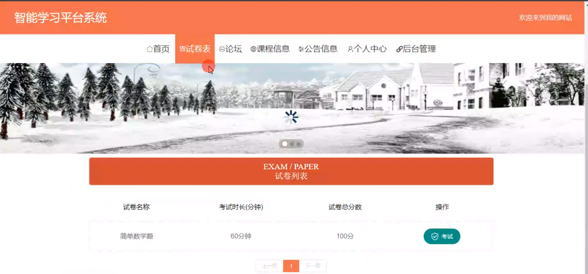

论坛

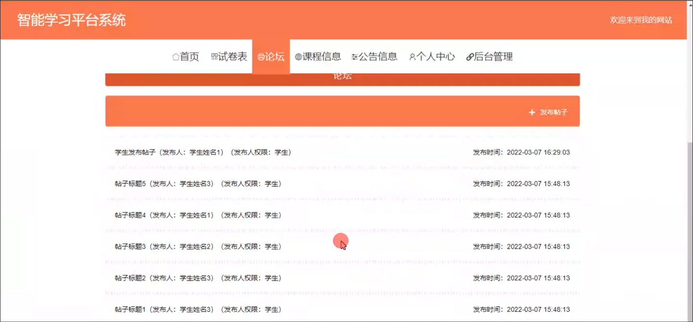

课程信息

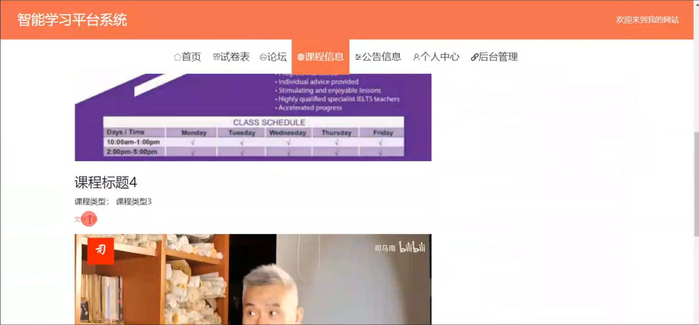

公告信息

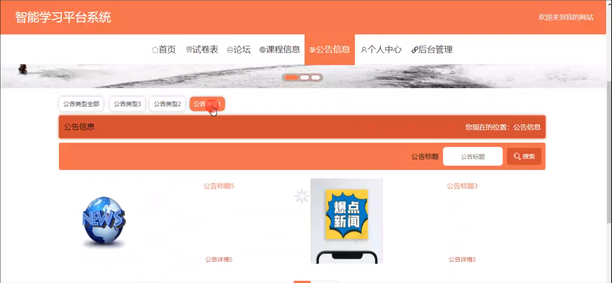

个人中心

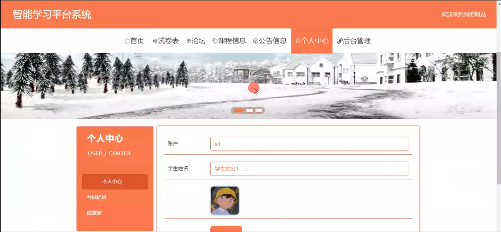

学生端后台管理

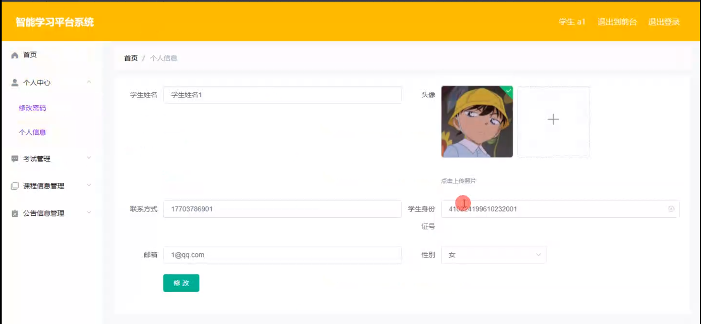

考试管理

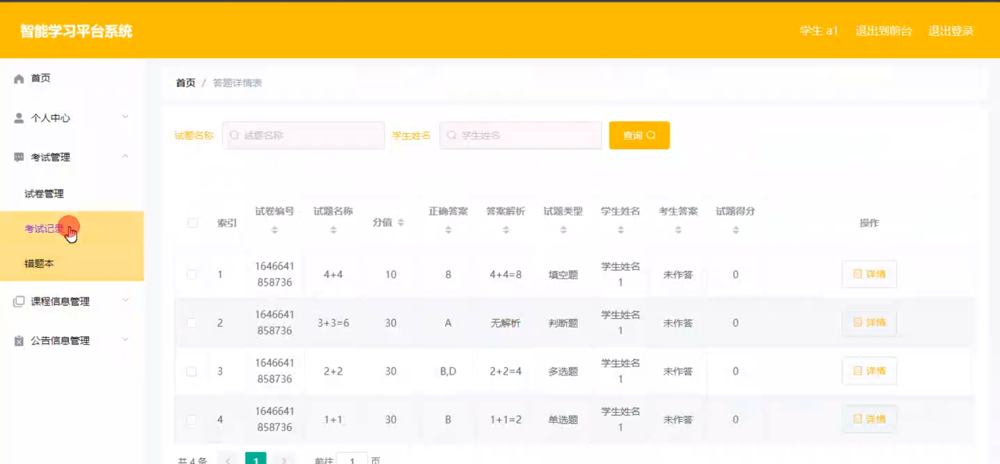

教师端公告信息管理

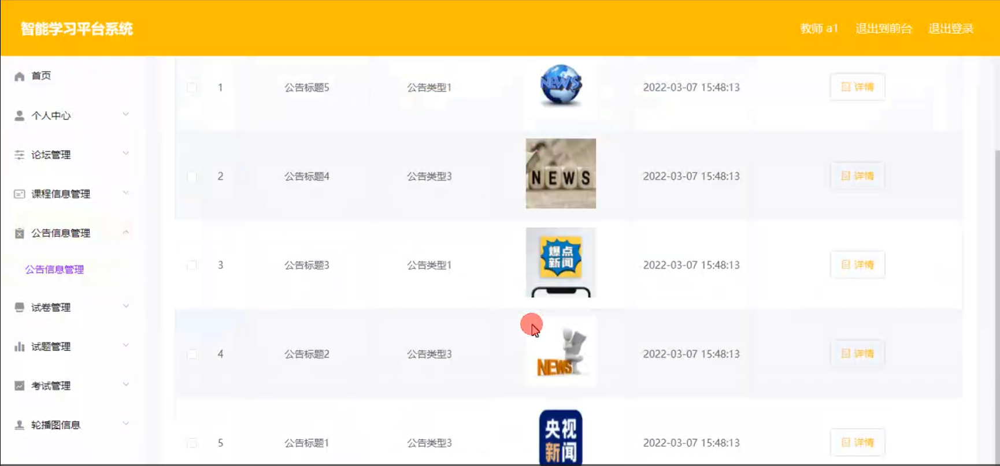

试卷管理

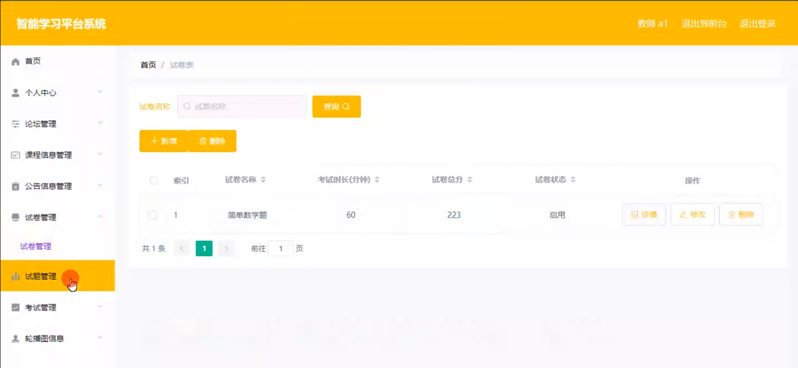

考试记录管理

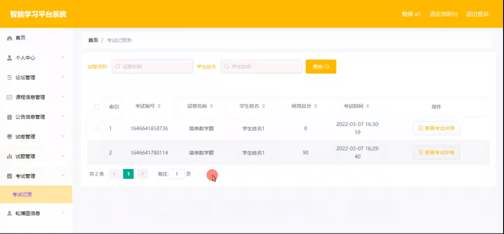

轮播图信息管理

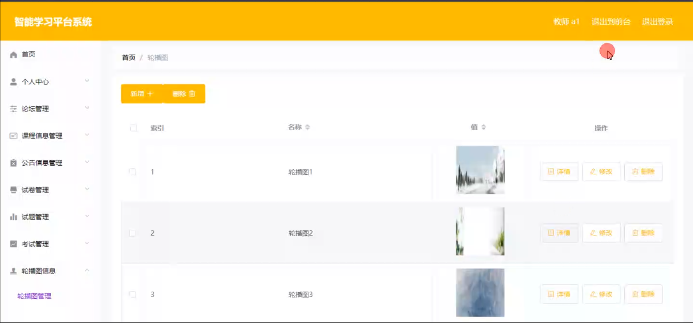

管理员端学生管理

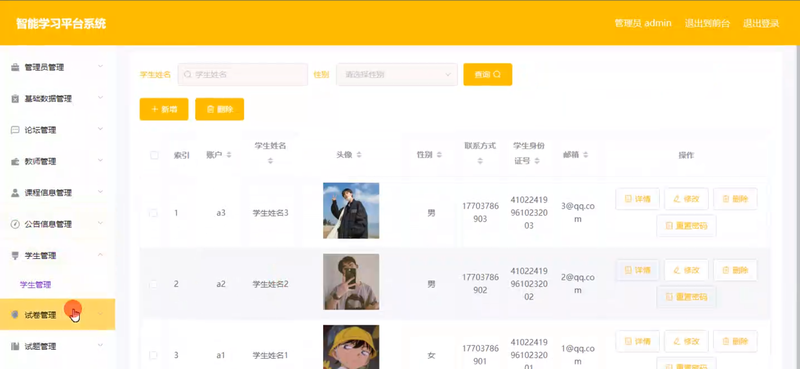

教师管理

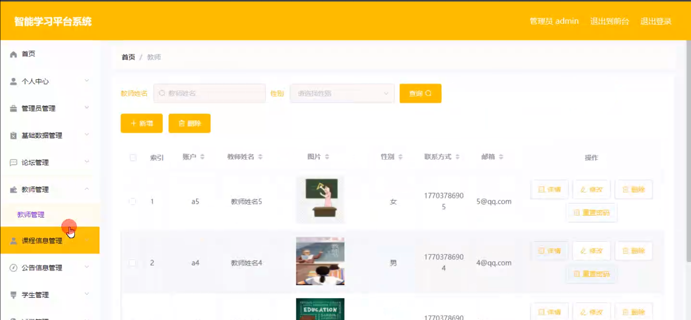

#### 总结

基于 Spring Boot 的智能学习平台系统，通过明确管理端、教师端和学生端的功能模块，构建了一个完整的在线学习生态。该系统有助于打破时间和空间的限制，实现优质教育资源的共享，推动教育的创新和发展，为培养适应时代需求的人才提供有力支持。

#### 使用说明

创建数据库，执行数据库脚本 修改jdbc数据库连接参数 下载安装maven依赖jar 启动idea中的springboot项目

前台登录页面
http://localhost:8080/zhinengxuexipingtai/front/index.html

后台登录页面
http://localhost:8080/zhinengxuexipingtai/admin/dist/index.html

管理员				账户:admin 		密码：admin

教师				账户:a1 		密码：123456

学生				账户:a1 		密码：123456